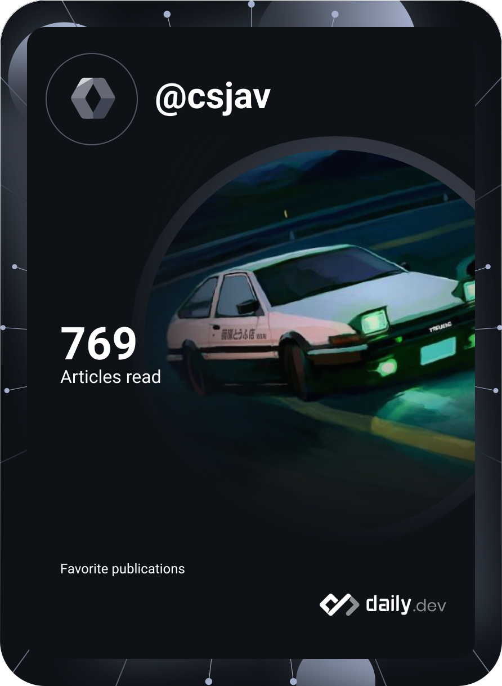

# Carlos Rios

**Godot game engineer.** I also build the TypeScript tools I actually use to ship.

[Steam](https://store.steampowered.com/app/4541820/Aditore/)
·
[Trailer](https://youtu.be/g6K20rxRSjk)
·
[LinkedIn](https://www.linkedin.com/in/csjav)

 

<table>
<tr>
<td valign="top" width="62%">

**Aditore** is a Godot tactics game on Steam: grid combat, a hub, and an art pipeline from Blender into Godot.

[Play on Steam](https://store.steampowered.com/app/4541820/Aditore/) · [Watch the trailer](https://youtu.be/g6K20rxRSjk)

### Also in production

| Project | What it is |
| --- | --- |
| **Lanes** | Local-first kanban with an agent bridge and MCP server |
| **Scrollshot** | Browser extension: full-page capture, scroll, stitch |
| **Toybox** | Blender addon — mesh rescue, rotate-snap, pipeline QoL |
| **YouTube List Manager** | MV3 extension for list ops that survive YouTube's DOM |

Source for those stays closed. The public build is Aditore.

</td>
<td valign="top" width="38%" align="center">

</td>
</tr>
</table>

  
   
  

